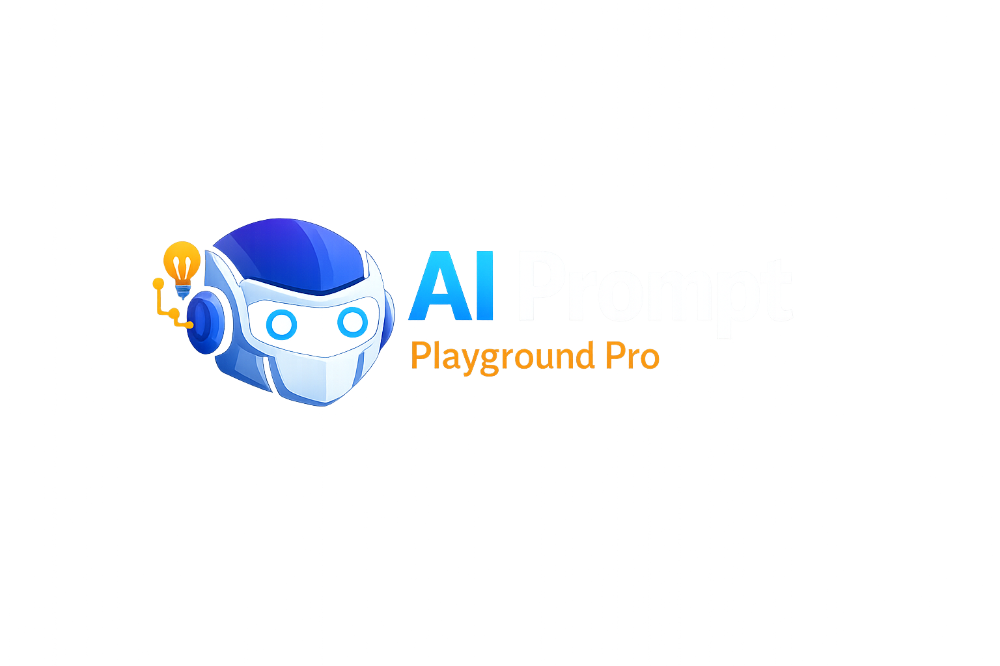
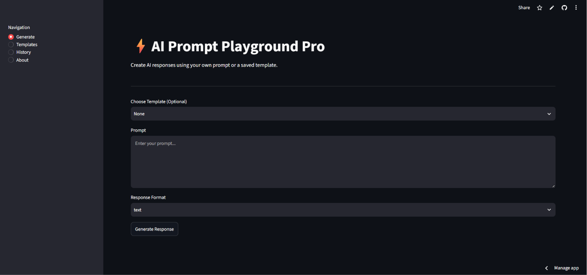
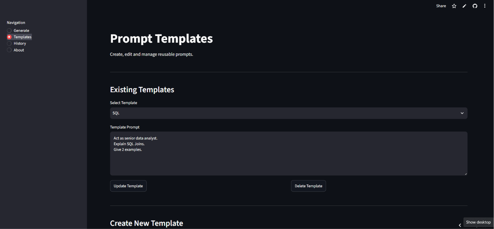
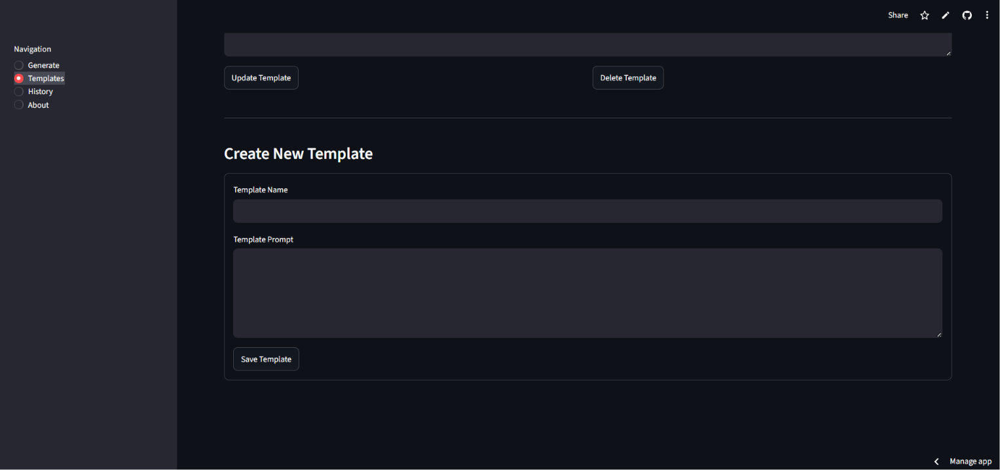
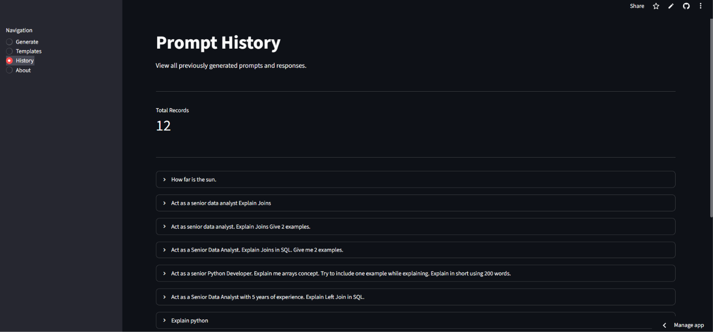
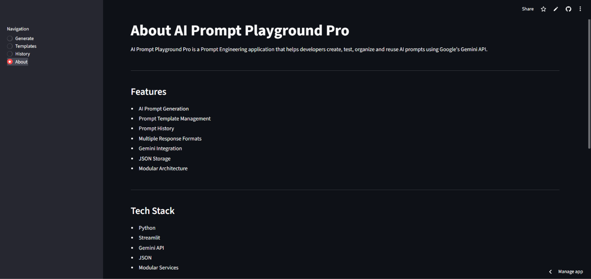
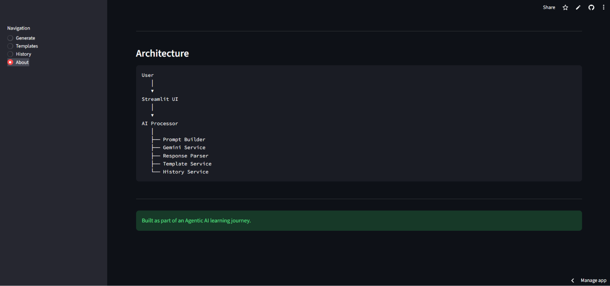

<p align="center">
  
</p>

<h1 align="center">AI Prompt Playground Pro</h1>

AI Prompt Playground Pro is an AI-powered web application built using **Python**, **Streamlit**, and **Google Gemini API**. It allows users to create, test, manage, and reuse AI prompts through an intuitive interface while demonstrating clean software architecture and prompt engineering concepts.

This project was built as part of my **Agentic AI learning journey** to gain hands-on experience with Large Language Models (LLMs), prompt engineering, modular Python development, and AI application deployment.

---

# Live Demo

> **Live Application:** https://ai-prompt-playground-pro-bvbh3fxkhn2aiuwckaflnm.streamlit.app/

---

# Features

## AI Prompt Generation

* Generate responses using Google's Gemini model
* Enter custom prompts through a simple web interface
* Choose different response formats:

  * Plain Text
  * Markdown
  * JSON
* Display formatted AI responses instantly

---

## Prompt Templates

Create reusable prompt templates to avoid writing the same prompts repeatedly.

Features include:

* Create new templates
* View saved templates
* Edit existing templates
* Update template prompts
* Delete templates
* Duplicate template name validation

Templates are stored locally in a JSON file.

---

## Prompt History

Every generated prompt is automatically saved along with its response.

Each history record contains:

* Original Prompt
* Enhanced Prompt
* Response Format
* Gemini Model Used
* AI Generated Response

History is displayed in reverse chronological order for quick access.

---

## Modular Architecture

The application follows a clean, service-based architecture.

Instead of placing all logic inside the Streamlit application, responsibilities are separated into independent modules.

Generation workflow:

```
User Prompt
      │
      ▼
Prompt Builder
      │
      ▼
Gemini Service
      │
      ▼
Response Parser
      │
      ▼
History Service
      │
      ▼
Display Response
```

This architecture improves:

* Maintainability
* Readability
* Reusability
* Scalability
* Testability

---

# Project Structure

```
ai-prompt-playground-pro/
│
├── app/
│   ├── ai_processor.py
│   ├── prompt_builder.py
│   └── response_parser.py
│
├── services/
│   ├── gemini_service.py
│   ├── history_service.py
│   └── template_service.py
│
├── config/
│   └── settings.py
│
├── data/
│   ├── history.json
│   └── templates.json
│
├── app.py
├── requirements.txt
├── README.md
└── .gitignore
```

---

# Technologies Used

### Programming Language

* Python

### AI

* Google Gemini API
* Prompt Engineering

### Frontend

* Streamlit

### Data Storage

* JSON

### Configuration

* python-dotenv
* Environment Variables

### Version Control

* Git
* GitHub

---

# Software Engineering Concepts Demonstrated

This project showcases several software engineering principles, including:

* Modular Architecture
* Separation of Concerns
* Single Responsibility Principle (SRP)
* Service Layer Pattern
* Configuration Management
* CRUD Operations
* Error Handling
* JSON Data Persistence
* Environment Variable Management
* Clean Code Organization

---

# Installation

Clone the repository:

```bash
git clone https://github.com/<your-username>/AI-Prompt-Playground-Pro.git
```

Navigate to the project:

```bash
cd AI-Prompt-Playground-Pro
```

Install dependencies:

```bash
pip install -r requirements.txt
```

Create a `.env` file:

```env
GEMINI_API_KEY=your_api_key_here
```

Run the application:

```bash
streamlit run app.py
```

---

# Screenshots

* Generate



* Templates




* History



* About




---

# Known Limitations

Current Version (v1.0) stores data using local JSON files.

Because there is no authentication or database integration, all users of the deployed application share the same prompt history and templates.

This limitation is acceptable for Version 1.0 because the primary goal is to demonstrate:

* Gemini API integration
* Prompt engineering
* Modular software architecture
* CRUD operations
* Streamlit development

A production-ready version would use user authentication (e.g., Firebase or Supabase) together with a database so that each user has private templates and prompt history.

---

# Challenges Solved

During development, several real-world issues were encountered and resolved:

* Google Gemini API quota (429 Resource Exhausted)
* Streamlit deployment API key configuration
* Template deletion bug (ID vs Name mismatch)
* Duplicate template validation
* Understanding Streamlit's rerun behavior
* Designing around rerun limitations without using `st.session_state`
* Shared JSON storage limitation in deployed applications

These challenges helped improve debugging skills, architectural thinking, and deployment knowledge.

---

# Future Improvements

Potential enhancements for future versions include:

* User Authentication
* Database Integration
* Private Prompt History
* Favorite Templates
* Template Categories
* Prompt Search
* Dark Mode
* Export Prompt History
* Response Comparison
* Multi-Model Support (Gemini, OpenAI, Claude)
* Cloud Database Storage

---

# Version

**Current Version:** v1.0.0

Status:

* Completed
* Deployed
* Portfolio Ready

---

# Author

**Nidhi**

Built as part of my Agentic AI learning journey to explore Large Language Models, Prompt Engineering, and AI application development.

